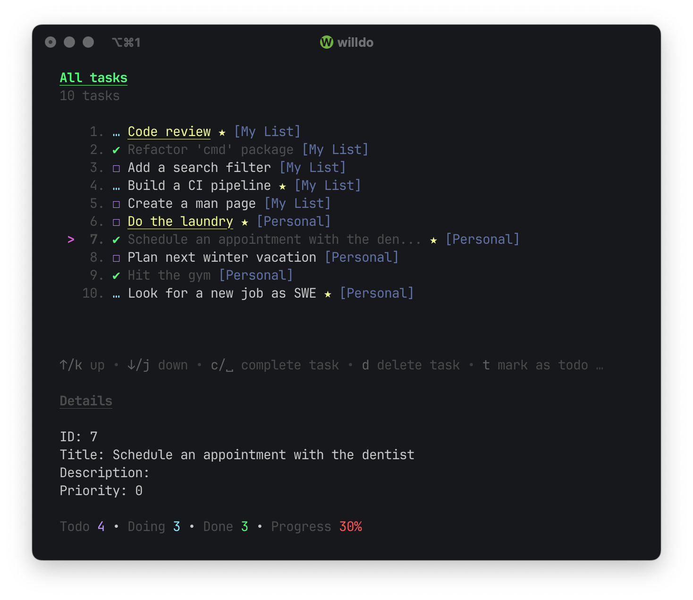

<h1 align="center">
  willdo
</h1>

<h3 align="center">
 A lightweight and minimal command line task manager
</h3>

<div align="center">
  
</div>

**willdo** is a fast, lightweight and minimal task manager aimed at terminal habitants who 
need an easy to use command line tool that helps to keep track of tasks and ideas without
getting too much in the way and focusing on what is really important, which is helping to
streamline workflows, organization, planning and productivity without the need of a bloated GUI.

## Features

- group tasks by category
- set different priority levels
- set different progress state
- add descriptions to tasks
- filter by category
- filter by priority level
- filter by progress state
- filter favorites
- customize the filesystem location of the sqlite database
- manage most task properties in a TUI
- update task properties on the command line
- move tasks between categories
- fast, lightweight and minimal
- pretty terminal output

## Table of Contents

* [Build](#build)
* [Install](#install)
* [Configure](#configure)
* [Usage](#usage)
* [Task properties](#task-properties)
* [Category properties](#category-properties)
* [Acknowledgements](#acknowledgements)
* [License](#license)

***

## Build

### Prerequisites

To build **willdo** you will need to install atleast version 1.24.4 of Golang which can be done by following
[this](https://go.dev/doc/install) documentation. 

After that you will have to install the following dependencies:

#### Debian, Ubuntu, Mint

``` Bash
sudo apt update
sudo apt install make git asciidoctor
```

#### Fedora, RHEL, centOS

``` Bash
sudo dnf update
sudo dnf install make git asciidoctor
```

### Clone & Build

Once that is done you can clone this repository

``` Bash
cd ~
git clone https://github.com/cgoesche/willdo.git
cd willdo
make
```

## Install

If you have build without errors you can now install **willdo** and its manpage.

``` Bash
make install
```
The default installation location for **willdo** is `/usr/local/bin`, however on some read-only systems this might cause issues
and you might also prefer to install it at a custom location. In that case simply run the command like this:

``` Bash
INSTALL_DIR="<DIRECTORY PATH>" make install
```

## Configure

The configuration file is expected to be located at `~/.config/willdo/config.yaml` on GNU/Linux 
and `~/Library/Application Support/willdo/config.yaml` on macOS. However, you can define a different file 
either with the `--config` flag. 

Example:

``` Bash
willdo --config="<CONFIG FILEPATH>" --all
```

Here is how a valid configuration file could look like:

``` Yaml
---
  database:
    type: "sqlite"
    filepath: "/home/user/willdo.db"
    address: "127.0.0.1"
    port: 8888
```

Note that for now the `address` and `port` parameters are ignored when the `type` is set to `"sqlite"` and will be of use when support for
other network connected database types has been added, e.g. MongoDB, Postgres or MySQL. Additionally, to run **willdo** a configuration file 
is not needed because it will simply apply default values, but it is still recommended.

## Task properties

Tasks have the following properties:

- ID
- Title
- Description
- Status ( Todo: 0, Doing: 1, Done: 2)
- Priority ( Low: 0, Medium: 1, High: 2)
- IsFavorite ( False: 0, True: 1)
- Category 

The numeric values for `Status`, `Priority` and `IsFavorite` are used for modifications at the command line just as you can see in the usage examples below. 

## Category properties

Categories have the following properties:

- ID
- Name
- Description

## Usage

### Add a task

``` Bash
willdo task --category "My List" -t "Review all PRs tagged with 'proposal' and 'enhancement'" -f 1
```

### Edit category name

``` Bash
willdo edit category -c "My List" -n "Personal List"
```

### Edit task priority

``` Bash
willdo edit task --id 3 --priority 2
```

### List tasks of a specific category

``` Bash
willdo -c "Personal List"
```

### Add a category

``` Bash
willdo category --name "Winter vacation" --description "Task list for our family vacation to Aspen"
```

### Key mapping

* `c`, `spacebar` complete task
* `d`, `D` delete task
* `f`, `F` (un)mark as favorite
* `s`, `S` start task
* `t`, `T` mark as todo
* `q` quit

* `g`, `home` go to start
* `G`, `end` go to end 
* `←`, `h`, `pgup` prev page 
* `↓`, `j` down
* `↑`, `k` up 
* `→`, `l`, `pgdn` next page 
* `?` open/close help

* `ctrl-d` filter done tasks
* `ctrl-f` filter favorites
* `ctrl-h` filter high priority task
* `ctrl-j` filter mid priority tasks
* `ctrl-l` filter low priority tasks
* `ctrl-s` filter doing tasks
* `ctrl-t` filter todo tasks
* `ctrl-x` clear completed tasks 

* `alt-r` refresh list
* `alt-d` show/hide details
* `alt-s` show/hide stats

### Environment variables

`WILLDO_DATABASE_TYPE`
Sets the database type to use. For now only "sqlite" is supported.

`WILLDO_DATABASE_FILEPATH`
An absolute or relative filepath for the database.

`WILLDO_DATABASE_ADDRESS`
Specifies the network address of the network connected database. (not used)

`WILLDO_DATABASE_PORT`
Specifies the listen port of the network connected database. (not used)

## Acknowledgements

Behind the scenes **willdo** uses:

- [Bubbletea](https://github.com/charmbracelet/bubbletea) for the TUI
- [Viper](https://github.com/spf13/viper) to read the configuration file
- [Cobra](https://github.com/spf13/cobra) for the command line argument and option parsing
- [Lipgloss](https://github.com/charmbracelet/lipgloss) to style the terminal output

## License

willdo is released under the GPLv3 license.
For details check the [LICENSE](LICENSE) file.
